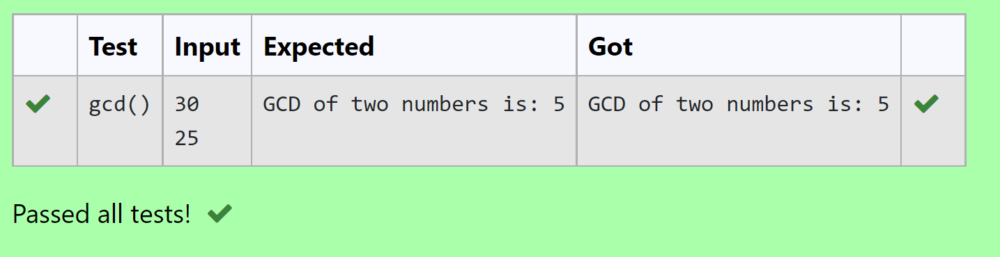

# Find the GCD of two numbers

## AIM:
To write a program to find the GCD of two numbers using function.

## EQUIPMENT'S REQUIRED:
1. Hardware – PCs
2. Anaconda – Python 3.7 Installation / Moodle-Code Runner

## ALGORITHM:
1. Define a function.
2. Get the two numbers from the user.
3. Compare the two values, to find the smaller number.
4. Use for() and if() loop to find the GCD of the two numbers.

## PROGRAM:
```
Program to find the gcd of a number using function.
Developed by: Aashima Nazreen Sayeed S
RegisterNumber: 21500368

def gcd():
    n1=int(input())
    n2=int(input())
    if(n1>n2):
        smaller=n2
    else:
        smaller=n1
    for i in range(1,smaller+1):
        if(n1%i==0 and n2%i==0):
            GCD=i
    print("GCD of two numbers is:",GCD)
```

## OUTPUT:



## RESULT:
Thus the program to find the GCD of two numbers is written and verified using python programming.
